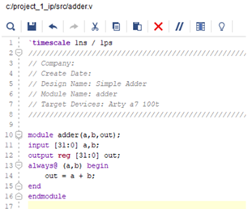
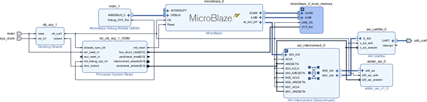
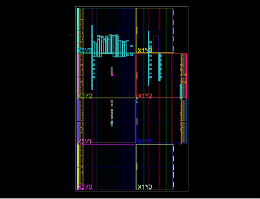
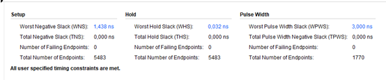
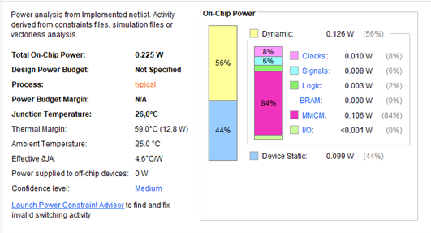
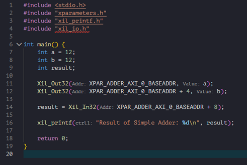

# MicroBlaze AXI4-Lite Adder on Arty A7-100T

Hardware–Software Co-Design Tutorial using Xilinx Vivado & Vitis.

This project presents the implementation and validation of a custom AXI4-Lite peripheral (simple hardware adder) integrated with a MicroBlaze soft-core processor on the Arty A7-100T FPGA.

## Motivation

While working on this implementation, it became apparent that clear, 
step-by-step examples of custom AXI4-Lite peripheral integration 
with MicroBlaze on the Arty A7-100T platform were limited.

This tutorial aims to provide a clean and complete reference 
covering the full hardware–software workflow 
(Vivado → Bitstream → Vitis), including timing and power validation.

## 1. System Overview

- Custom AXI4-Lite Peripheral (32-bit Adder)
- MicroBlaze Soft Processor
- AXI Interconnect Communication
- Timing & Power Analysis Validation
- Full Hardware–Software Flow (Vivado → Vitis)

## 2. System Architecture

The system follows a memory-mapped architecture in which the MicroBlaze processor communicates with the custom AXI4-Lite peripheral through the AXI Interconnect.

The architecture enables hardware–software interaction using standard AXI protocol transactions.

## 2.1 Creating the custom AXI Peripheral

A custom AXI4-Lite peripheral was created in Vivado, where a simple hardware adder module was integrated.  

The adder module receives two 32-bit input values and returns their sum.

### 2.2 Adder module

<p align="center">
  
</p>

The adder module is not directly embedded inside the AXI slave logic. Instead, it is instantiated within the AXI slave, allowing access to its input and output values through the appropriate AXI memory-mapped registers

### 2.3 AXI Slave Integration

The read and write operations are handled through the AXI memory-mapped registers. Inside the AXI slave code, the adder is instantiated as follows:


```verilog
adder uut (
	.a(slv_reg0),
	.b(slv_reg1),
	.out(slv_reg2_out)
);

```

### AXI Memory Map

| Offset | Register        | Description      |
|--------|----------------|------------------|
| 0x00   | slv_reg0       | Operand A        |
| 0x04   | slv_reg1       | Operand B        |
| 0x08   | slv_reg2_out   | Result Register  |


The custom AXI peripheral communicates with the MicroBlaze processor through the AXI Interconnect, enabling hardware–software interaction via memory-mapped I/O.

## 3. Block Design Architecture

After creating the custom AXI4-Lite peripheral, the complete system was assembled using Vivado's Block Design environment.

The following components were added:

- **MicroBlaze Processor**  
  The main soft-core processor of the system, responsible for executing the software application.

- **AXI Interconnect**  
  Enables communication between the MicroBlaze processor and the AXI-based peripherals.

- **Clocking Wizard**  
  Generates and manages the system clock signals required for proper synchronization.

- **Processor System Reset**  
  Handles the reset signals for the processor and connected peripherals.

- **AXI UARTLite**  
  Provides serial communication via USB, enabling data exchange and debugging through a terminal.

- **Custom AXI Adder Peripheral**  
  The hardware peripheral implementing the adder logic, accessible via AXI memory-mapped registers.

### 3.1 Vivado Block Design

The final block design connects the MicroBlaze to the custom AXI adder through the AXI Interconnect.  
All components are synchronized through the Clocking Wizard, while the Processor System Reset ensures proper initialization of the system.


<p align="center">
  
</p>


## 4. Synthesis, Implementation and Bitstream Generation

After completing the Block Design, the hardware design flow proceeded with the following stages:

### 4.1 Synthesis

Synthesis is the process of transforming the high-level hardware description (HDL and Block Design) into a gate-level representation that can be implemented on the FPGA.

The output of this stage is a **gate-level netlist**, which describes the circuit in terms of:

- Logic gates
- Flip-flops
- LUTs (Look-Up Tables)
- Other FPGA primitives

At this stage, the functional design is converted into a technology-specific representation suitable for the target FPGA device.

### 4.2 Implementation

During Implementation, the synthesized logic is mapped onto the physical resources of the FPGA.

This stage includes:

- **Placement** → Assigning logical elements to specific FPGA resources  
- **Routing** → Connecting the placed elements using the FPGA interconnect fabric  
- **Timing Optimization** → Ensuring timing constraints are satisfied  

In other words, after the design is converted into logic gates and flip-flops during synthesis, Implementation determines:

- Which physical resources of the FPGA will be used  
- How they will be interconnected  

### 4.3 Bitstream Generation

FPGAs are configured using a binary file known as a **bitstream**.

The bitstream contains:

- Configuration data for the FPGA logic fabric  
- Routing information  
- Initialization values  
- Device-specific configuration instructions  

Once generated, the bitstream is programmed into the FPGA device, configuring it to implement the desired hardware design.

### 5. Post-Implementation Design

After successful Implementation, the finalized hardware design was generated and validated prior to programming the FPGA board.

<p align="center">
  
</p>

## 6. Timing and Power Analysis

After successful implementation, detailed timing and power reports were analyzed to validate the design.

### 6.1 Timing Report

### Timing Summary for the Implemented Design

<p align="center">
  
</p>

### Setup Timing Analysis

- **Worst Negative Slack (WNS): 1.438 ns**

  The WNS represents the setup slack of the critical path.  
  If WNS is negative, at least one path violates timing constraints and the circuit may not operate correctly at the specified clock frequency.

  In this design, the WNS is **positive (1.438 ns)**, which indicates that all setup timing constraints are satisfied.

- **Total Negative Slack (TNS): 0 ns**

  TNS is the sum of all negative slack values across the entire design.  
  Since TNS = 0 ns, there are no failing paths.

- **Number of Failing Endpoints: 0**

  All paths pass timing verification.

### Hold Timing Analysis

- **Worst Hold Slack (WHS): 0.032 ns**

  WHS indicates the smallest hold slack in the design.  
  If negative, it would indicate potential data corruption due to hold violations.

  In this case, WHS is positive (0.032 ns), meaning all hold constraints are satisfied.

- **Total Hold Slack (THS): 0 ns**
- **Number of Failing Endpoints: 0**

  No hold violations were detected.

### Pulse Width Timing

- **Worst Pulse Width Slack (WPWS): 3.000 ns**
- **Total Pulse Width Negative Slack (TPWS): 0 ns**
- **Number of Failing Endpoints: 0**

All pulse width constraints are satisfied.

### Timing Conclusion

According to the timing report, all setup, hold and pulse width constraints are satisfied.  
The design meets timing requirements for the selected clock frequency.

### 6.2 Power Report

### Power Analysis Summary

<p align="center">
  
</p>

### Total On-Chip Power

- **Total On-Chip Power: 0.225 W**
- **Junction Temperature: 26.0 °C**

For optimal performance and stability, the junction temperature should remain below 90 °C.  
At 26.0 °C, the device operates well within safe thermal limits.

- **Thermal Margin: 59.0 °C (12.8 W)**

This indicates significant thermal headroom before overheating becomes a concern.

- **Power supplied to off-chip devices: 0 W**

All reported power consumption corresponds to on-chip FPGA resources.

### On-Chip Power Breakdown

- **Dynamic Power: 0.126 W (56%)**
  - Clocks: 0.010 W (8%)
  - Signals: 0.008 W (6%)
  - Logic: 0.003 W (2%)
  - BRAM: 0.000 W (0%)  
    (No Block RAM resources were used)
  - MMCM: 0.106 W (84%)
  - I/O: <0.001 W (0%)

- **Device Static Power: 0.099 W (44%)**

Static power represents the baseline power consumption of the FPGA device.

### Power Conclusion

The design demonstrates low total power consumption (0.225 W) and excellent thermal behavior, with a large thermal margin and no excessive dynamic resource usage.

## 7. Transition to Vitis – Software Development

After generating the bitstream, the hardware platform was exported from Vivado using the **Export Hardware** option.

An `.xsa` file was generated, containing:

- The hardware design
- The bitstream (optionally pre-synthesis configuration)
- System configuration data

The project was then imported into **Vitis**, where a C application was developed to control the custom AXI adder.

## Software Application (Vitis)

A C program was implemented to manage communication between the MicroBlaze processor and the AXI adder peripheral, enabling interaction with the Arty A7 100T FPGA.

### Included Libraries

The program includes the following headers:

- `xparameters.h` → Contains hardware-specific base addresses  
- `xil_printf.h` → Provides UART-based printing functionality  
- `xil_io.h` → Enables memory-mapped I/O access  

### Code Overview


<p align="center">
  
</p>


## 8. Conclusions

The implementation demonstrates successful communication between the MicroBlaze processor and a custom AXI4-Lite peripheral through the AXI Interconnect.

Using Vivado for hardware design and Vitis for software development enabled a complete hardware–software co-design workflow for implementing a simple adder on the Arty A7 100T FPGA.

The AXI UARTLite peripheral enables communication between the FPGA board and a host PC, allowing verification of the hardware computation results.

## 9. How to Reproduce

1. Open Vivado 2023.x
2. Create new MicroBlaze design
3. Add AXI4-Lite custom peripheral
4. Generate Bitstream
5. Export Hardware (.xsa)
6. Import into Vitis
7. Build & Run application
